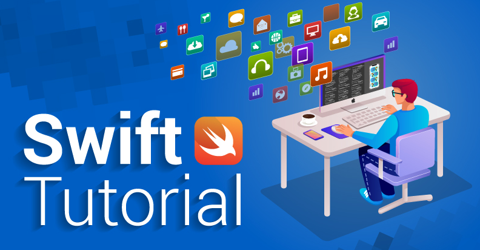

# Swift Video Tutorial 🎥



An AVPlayer is a controller object used to manage the playback and timing of a media asset. You can use an AVPlayer to play local and remote file-based media, such as QuickTime movies and MP3 audio files, as well as audiovisual media served using HTTP Live Streaming.

AVPlayer is for playing a single media asset at a time. You can reuse the player instance to play additional media assets using its replaceCurrentItem(with:) method, but it manages the playback of only a single media asset at a time. The framework also provides a subclass of AVPlayer, called AVQueuePlayer, you use to create and manage the queuing of media assets played sequentially.

You use an AVPlayer to play media assets, which AVFoundation models using the AVAsset class. AVAsset only models the static aspects of the media, such as its duration or creation date, and on its own, is unsuitable for playback with an AVPlayer. To play an asset, you need to create an instance of its dynamic counterpart found in AVPlayerItem. This object models the timing and presentation state of an asset played by an instance of AVPlayer. See the AVPlayerItem reference for more details.

## Lessons 📖

- [Playing Video](https://github.com/halilozel1903/SwiftVideoTutorial/tree/master/PlayingVideo) <br>

Playback of video added to XCode file


<br><br>

- [Stream Video](https://github.com/halilozel1903/SwiftVideoTutorial/tree/master/StreamVideo) <br>

URL playback from the Internet


- [YouTube Video](https://github.com/halilozel1903/SwiftVideoTutorial/tree/master/YouTubeVideo) <br>

URL embed playback from the YouTube


## License
```
MIT License

Copyright (c) 2022 Halil OZEL

Permission is hereby granted, free of charge, to any person obtaining a copy
of this software and associated documentation files (the "Software"), to deal
in the Software without restriction, including without limitation the rights
to use, copy, modify, merge, publish, distribute, sublicense, and/or sell
copies of the Software, and to permit persons to whom the Software is
furnished to do so, subject to the following conditions:

The above copyright notice and this permission notice shall be included in all
copies or substantial portions of the Software.

THE SOFTWARE IS PROVIDED "AS IS", WITHOUT WARRANTY OF ANY KIND, EXPRESS OR
IMPLIED, INCLUDING BUT NOT LIMITED TO THE WARRANTIES OF MERCHANTABILITY,
FITNESS FOR A PARTICULAR PURPOSE AND NONINFRINGEMENT. IN NO EVENT SHALL THE
AUTHORS OR COPYRIGHT HOLDERS BE LIABLE FOR ANY CLAIM, DAMAGES OR OTHER
LIABILITY, WHETHER IN AN ACTION OF CONTRACT, TORT OR OTHERWISE, ARISING FROM,
OUT OF OR IN CONNECTION WITH THE SOFTWARE OR THE USE OR OTHER DEALINGS IN THE
SOFTWARE.
```
